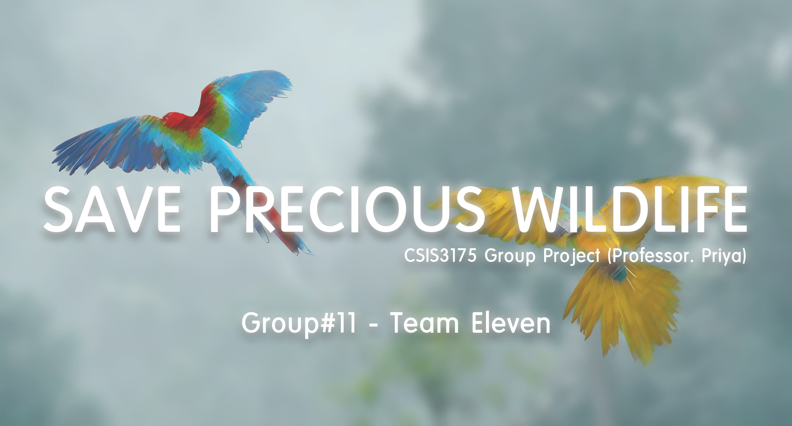

    
  
Save Precious Wildlife (v1.22)
======================

### □ Group Name : *Team Eleven* ###

### □ Group Member ###
  - Kateryna 
  - Jagjit 
  - Mark
  
### □ Version Control ###

#### > Application v1.1 : ####
  - Solved merging conflicts.
  
#### > Application v1.2 : ####
  - Fixed registration fragment problem
  - Fixed reportBird fragment problem
  
#### > Application v1.21 : ####
  - Changed placeholder image in VolunteerDetailsActivity  

#### > Application v1.22 (latest) : ####
  - Fixed database error (Drop and create table)
  - Removed unnecessary dependency (Glide)

### □ Contributions ###

  

  
  

### □ PayPal login and password information for testing ###
Login: donation12345@protonmail.com
Password: donation12345

### □ The Project Presentation Video Link ###
https://youtu.be/50Jox3VHcCE

### □ The Group Project Report Document ###
https://drive.google.com/file/d/19mPyyfXGbXN1V95t7li0ZoAily5f7wik/view?usp=sharing

